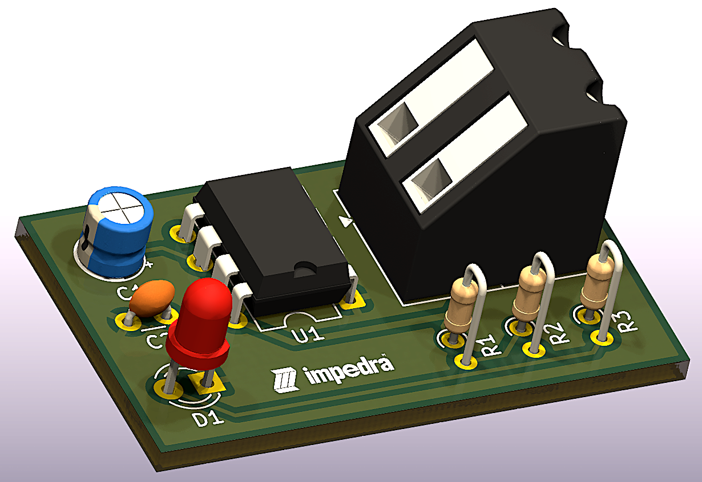
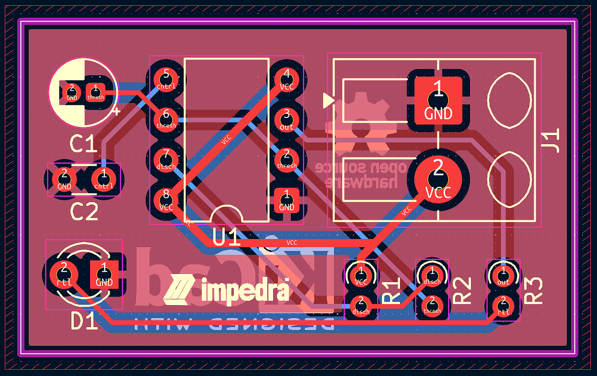

## Visuals

<table style="width:100%">
  <tr>
    <th style="text-align:center">3D Render</th>
    <th style="text-align:center">PCB Routing</th>
  </tr>
  <tr>
    <td style="width:50%"></td>
    <td style="width:50%"></td>
  </tr>
</table>